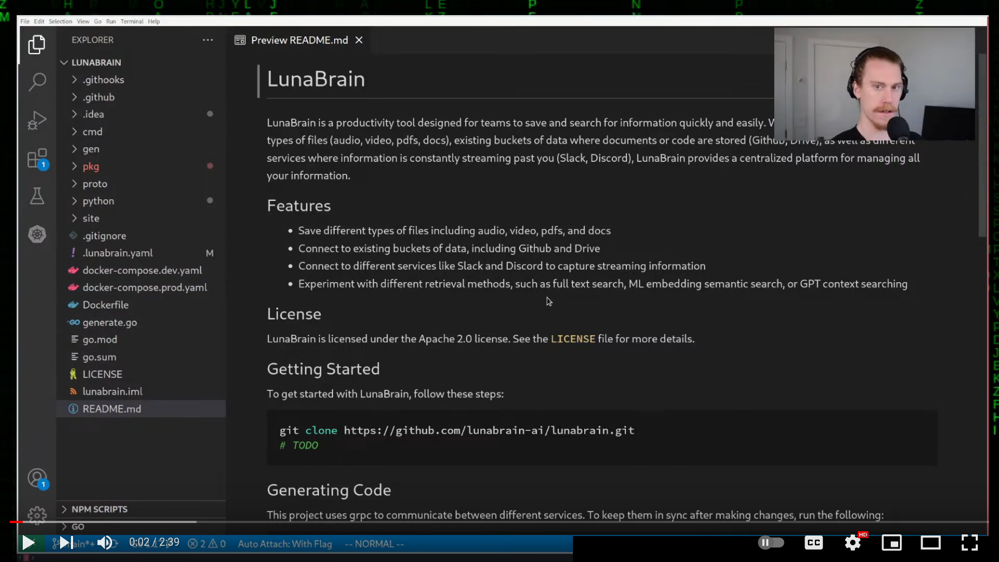

# LunaBrain

Build shared context with you and your homies.

[](https://www.youtube.com/live/UoRi3Fqh6Jg?si=CQVxzNWAqL6KOMa1&t=268 "LunaBrain Demo")

### Library 
- To use LunaBrain as a Go library, refer to the [documentation](https://pkg.go.dev/github.com/lunabrain-ai/lunabrain) (Note: This code is still like pre-alpha, so the API is subject to change)

## License

LunaBrain is licensed under the Apache 2.0 license. See the `LICENSE` file for more details.

## Getting Started

To get started with LunaBrain, follow these steps:

### Setup Repo

```shell
git clone --recursive https://github.com/lunabrain-ai/lunabrain.git
```

### Running
Backend
```shell
go run main.go start --dev
```

Since the static assets are generated, you could to go to http://localhost:8000 and it should work now.

If you want to hack on the frontend, keep reading.

Frontend
```shell
npm install
npm run dev:site
```

Extension
```shell
npm run dev:extension
````

## Hacking

### Installing Golang Dependencies

Are all these right? Are there more? Someone tell me.
```shell
go install google.golang.org/protobuf/cmd/protoc-gen-go@latest
go install google.golang.org/grpc/cmd/protoc-gen-go-grpc@latest
```

### Generating Code
This project uses grpc to communicate between different services. To keep them in sync after making changes, run the following:
```shell
go generate -x ./...
```

## Contributing

We welcome contributions to LunaBrain! To contribute, please follow these steps:

1. Fork the repository
2. Create a new branch for your feature
3. Make your changes
4. Submit a pull request

## Contact

Come hang out with us on [Discord](https://discord.gg/jSWJCHCV)!
